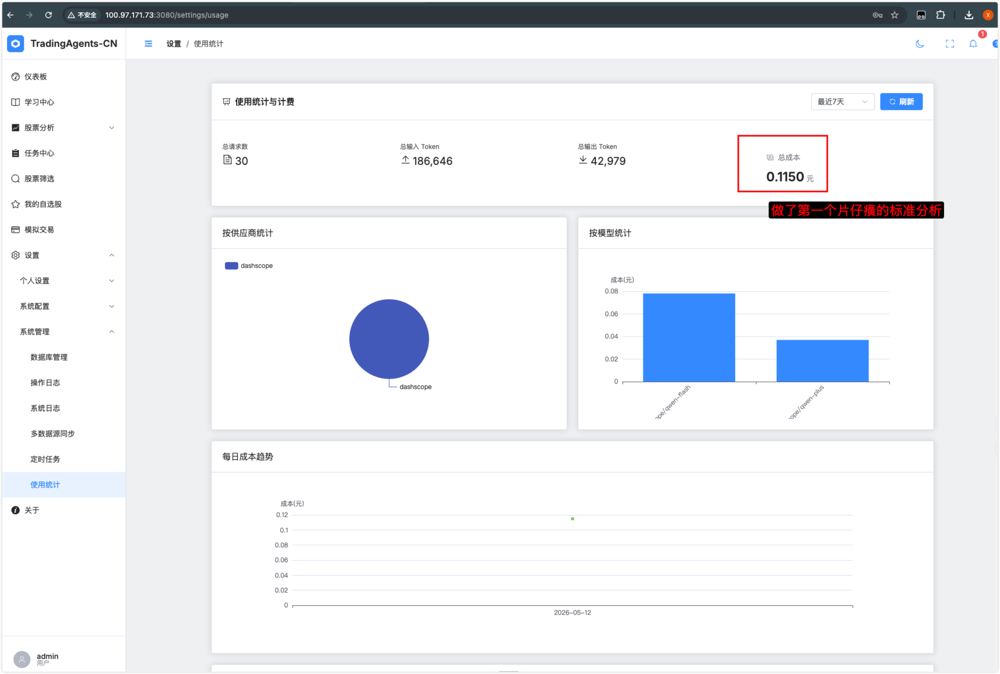

> **源项目地址:**https://github.com/TauricResearch/TradingAgents
>
> **中文版地址:**https://github.com/hsliuping/TradingAgents-CN

今天配置了安装了trading agents-CN这个开源的量化研究分析系统。这个系统是基于另外一个开源的的系统进行构建的，增加了对中国A股的支持以及中国大模型的支持，并且界面更加的友好，使用了Vue做前端,界面漂亮。当前版本最新是1.0.1。按照GitHub上面的介绍，因为有人假冒使用这个系统。作者决定2.0版本不再开源了。但是上游系统，Trading agents目前已经发展到了0.2.5版本。新增了分歧过程中断自动接续的功能，能够极大地节省token。而且还增加了分析结果保存、后续分析自动提取记忆的功能。这些都是很好的东西，目前先装这个汉化版，上游版本因为对中国A股支持的不友好，还是需要做一些更改才能使用，后续继续跟踪发展，做一个自己的定制版本。

模型配置了阿里云百炼, 还有DeepSeek，并且配置了tushare的API key.结果没想到第一个运行起来分析半中间就自动退出了，因为阿里千问模型的免费额度正好用完，没办法，充值100元，看看能做几次分析。

做了一个片仔癀的分析,花费0.115元,还是比较合算滴!

## 比较TradingAgents中文版与上游版本的区别

`TradingAgents-CN` (由 `hsliuping` 维护) 是针对 `TauricResearch/TradingAgents` 的深度本地化增强版本。

虽然 `v1.0.1` 在界面（Vue 3 + FastAPI）上做了很大革新，但其**底层逻辑和功能增强**才是它与原版的核心差异。以下是详细的比较分析：

### 1. 底层核心功能增强（非界面部分）

除了你提到的前端展示，`TradingAgents-CN v1.0.1` 在底层架构和业务逻辑上增加了以下关键功能：

- **多数据源集成（A 股适配）：**
  - **上游原版：** 主要依赖 `yfinance` 和 `Serper`，数据来源偏向美股。
  - **CN 版：** 底层集成了 **Tushare、AkShare 和 BaoStock**。这解决了 A 股数据获取的合规性、复权处理以及停牌数据过滤等本地化痛点。
- **本地化 LLM 驱动支持：**
  - **上游原版：** 早期版本侧重 OpenAI 和 Anthropic。
  - **CN 版：** 底层原生适配了 **DeepSeek、通义千问 (Qwen)、智谱清言 (GLM)** 等国内大模型厂商的 API 协议，并针对中文语境优化了 Prompt 模板，避免了原版翻译腔导致的逻辑偏差。
- **企业级基础设施：**
  - **数据库存储：** 引入了 **MongoDB** 用于持久化海量分析报告和决策日志，引入 **Redis** 作为多级缓存层，提高重复查询的响应速度（原版多为内存存储或简单的本地 JSON/Pickle）。
  - **任务并行化：** 针对 A 股个股众多的特点，优化了多智能体并发处理逻辑，支持**批量个股分析**（Batch Analysis）。
- **金融指标修正逻辑：**
  - **算法优化：** 针对中国市场修正了 PE（市盈率）、PB（市净率）等财务指标的计算逻辑（例如区分了 TTM、静、现等不同计算口径）。

### 2. 功能对比表

| **维度**     | **上游项目 (TauricResearch)** | **下游项目 (TradingAgents-CN v1.0.1)**   |
| ------------ | ----------------------------- | ---------------------------------------- |
| **主要市场** | 美股 (US Market)              | **中国 A 股 (A-Shares)** / 全球          |
| **数据引擎** | yfinance, Serper, NewsAPI     | **Tushare, AkShare**, Yahoo Finance      |
| **模型支持** | GPT-4, Claude 3.5, Gemini     | **DeepSeek, Qwen, GLM**, MiniMax, GPT-4  |
| **报告导出** | 终端输出 (Markdown)           | **Markdown / Word / PDF** 多格式专业报告 |
| **系统架构** | 单机脚本 / CLI 驱动           | **FastAPI + Vue 3** 微服务架构           |
| **认证审计** | 无                            | **RBAC 权限管理、操作审计日志**          |
| **消息推送** | 无                            | **飞书/钉钉/微信机器人** 实时通知        |

### 3. 基于上游的哪个版本？

`TradingAgents-CN v1.0.1` 是基于上游项目的 **2026 年初稳定版核心（Engine Core）** 进行二次开发的。

具体的追踪版本通常对应于上游项目的 `v0.1.0-alpha` 之后、引入 `LangGraph` 结构化决策链路后的版本。虽然 CN 版进行了大量的代码重构（如将原有的类定义拆分为更符合工程化的目录结构），但其核心的 **多智能体辩论（Multi-Agent Debate）** 和 **状态机跳转逻辑** 依然与上游保持同步。

------

**⚠️ 注意事项：**

目前 `TradingAgents-CN` 项目组已发布声明，由于市场上存在未经授权的商业化盗版（如 tradingagents-ai.com），作者 hsliuping 宣布 **v2.0 暂不开源**，目前公开的 `v1.0.1` 是最为稳定且功能完整的开源分支。

你是否已经申请了 Tushare 的 Token？如果你想在本地跑通 A 股分析，我建议优先配置 **AkShare**，因为它在 CN 版中是开箱即用且无需积分门槛的。

---

## 改动的工作量有多大？给一个形象化，量化的比较。给我个建议，我是直接使用上游版本，还是用目前的v1.0.1

要量化“从上游改造成 CN 版”的工作量，我们可以将其类比为从“毛坯房研究方案”到“精装修样板间”的跨越。

对于你这样有专业架构背景和量化实战经验（QMT、A 股）的开发者来说，以下是具体的工作量评估和选择建议：

### 1. 工作量量化与形象化对比

如果把 **TradingAgents (上游)** 比作一台性能强劲的**航空发动机原型机**，那么 **TradingAgents-CN v1.0.1** 就是一台已经装好外壳、配好航电系统、针对中国领空优化的**成熟战斗机**。

如果你选择在原版基础上自研改动，工作量分布如下：

| **模块**                 | **工作量占比** | **难度等级** | **量化描述**                                                 |
| ------------------------ | -------------- | ------------ | ------------------------------------------------------------ |
| **数据适配 (Data Sink)** | 20%            | ⭐⭐⭐          | 需重写数据类，接入 AkShare/Tushare，处理 A 股特有的代码后缀 (.SH/.SZ) 和复权逻辑。 |
| **基础架构 (Infra)**     | 40%            | ⭐⭐⭐⭐         | 将原版的内存/JSON 临时存储改为 **MongoDB + Redis**，并封装 **FastAPI** 接口。这是为了保证你大规模回测或监控时不崩溃。 |
| **Prompt 工程**          | 15%            | ⭐⭐⭐          | 将原版针对美股设计的 Prompt（如关注美联储、SEC 规则）翻译并优化为针对 A 股（如关注国常会、行业研报、散户情绪）的逻辑。 |
| **交互与交付 (UI/UX)**   | 25%            | ⭐⭐⭐          | 从命令行界面 (CLI) 升级到 Vue 3 仪表盘。对于需要给别人演示或长期监控的人来说，这是刚需。 |

**形象化结论：**

- **直接用上游并改造成 CN 版：** 相当于你需要进行 **200-300 小时** 的深度工程开发（非单纯搬砖，含调试决策逻辑）。
- **直接用 CN v1.0.1：** 相当于 **“拎包入住”**，你只需要花 30 分钟配置一下 `config.yaml` 里的 API Key。

------

### 2. 深度建议：你该选哪一个？

考虑到你拥有 **Mac Studio M1 (128GB RAM)** 这样的顶级性能环境，且熟悉 **Docker** 和 **n8n** 等自动化流程，我的建议如下：

#### 方案一：如果你追求“实战交易”和“快速产出”

**建议选择：TradingAgents-CN v1.0.1**

- **理由：** 它已经解决了最繁琐的 A 股本地化问题。你既然在用 QMT 做实盘/回测，你肯定知道 A 股的数据清洗（停牌、除权、ST 过滤）有多麻烦。CN 版已经替你跑通了这些流程。
- **优势：** 你可以立即利用你 128GB 内存的机器开启**大规模并发分析**。CN 版的架构更能压榨出 Mac Studio 的多核性能。

#### 方案二：如果你追求“学术研究”或“底层逻辑创新”

**建议选择：上游 (TauricResearch)**

- **理由：** 上游项目紧跟 MIT/UCLA 的最新学术论文。如果他们更新了 Agent 的“辩论策略”或“反思模型（Reflection）”，上游会第一时间更新。
- **劣势：** 你需要忍受美股数据的干扰，且所有的 A 股适配都需要你自己动手。

#### 方案三：折中方案（最推荐）

**使用 CN 版作为基础引擎，但手动同步上游的核心逻辑。**

1. 部署 **TradingAgents-CN v1.0.1** 获取成熟的 UI、A 股接口和数据库架构。
2. 关注上游项目的 `chains/` 或 `agents/` 目录下的 **Prompt 逻辑更新**。
3. 一旦上游有更先进的“博弈算法”，将其逻辑手动移植到 CN 版的后端代码中。

### 总结建议

**我是你的话，我会毫不犹豫地先跑通 `TradingAgents-CN v1.0.1`。**

因为对于量化交易者来说，“能看到 A 股数据”并“能导出 PDF 研报”是建立信任的第一步。你那台 128GB 内存的 Mac Studio 简直是跑这类多 Agent 框架的天堂——你可以尝试同时启动 50 个 DeepSeek 实例进行全市场扫描，这是上游那个简单的 CLI 脚本很难稳定支撑的场景。

**下一步操作建议：**

先通过 Git 克隆 CN 版，尝试用 **AkShare** 抓取一只你熟悉的 A 股标的（如“贵州茅台”或“宁德时代”），看看它生成的逻辑分析报告是否符合你这位 A 股老兵的直觉。

------

## 上游项目TradingAgents的 2026 年初稳定版核心（Engine Core）和目前最新的v0.2.5版本比较新增了哪些重要功能?

对于关注 `TradingAgents` 的开发者来说，从 **2026 年初的稳定版（通常指 v0.2.0）** 到最新的 **v0.2.5**，这个项目经历了一次从“研究原型”到“生产工具”的重大跨越。

如果你已经跑过之前的版本，你会发现 v0.2.5 在底层引擎上的改动比界面上的微调要深刻得多。以下是核心功能的新旧对比：

### 1. 核心架构：从“单次运行”到“可恢复状态”

- **v0.2.0 (年初稳定版)：** 如果程序在分析中途因为 API 超时或网络断开崩溃，你必须从头开始，这在进行多 Agent 深度辩论时非常浪费 Token。
- **v0.2.5 (最新版)：** 引入了 **LangGraph Checkpoint (持久化检查点)**。
  - **底层变化：** 使用 `--checkpoint` 参数后，系统会在每个 Agent 节点执行完后自动将状态写入本地 SQLite 数据库。
  - **价值：** 任务中断后可以**断点续传**，无需重新分析之前的研报，这对你 128GB 内存的 Mac 进行大规模批量分析非常关键。

### 2. 决策质量：从“文本生成”到“结构化输出”

- **v0.2.0：** 决策报告主要靠正则提取或 LLM 自由发挥。
- **v0.2.5：** 核心决策层（Research Manager, Trader, Portfolio Manager）全面改用 **Structured Output (Pydantic)**。
  - **底层变化：** 强制要求 LLM 返回特定格式的 JSON（利用 OpenAI/Gemini/DeepSeek 的原生工具调用能力），而非纯文本。
  - **价值：** 彻底杜绝了因 LLM 幻觉导致的“建议买入但没有给出仓位”等格式错误，系统生成的评级（5 档：Buy/Overweight/Hold/Underweight/Sell）现在具备了数据库级的严谨性。

### 3. 记忆系统：从“BM25 检索”到“闭环决策日志”

- **v0.2.0：** Agent 所谓的“记忆”只是简单的 BM25 文本关键词检索，它们并不真的“记得”上次预测准不准。
- **v0.2.5：** 引入 **Persistent Decision Log (持久化决策记录)**。
  - **底层变化：** 所有的历史决策会被记录并进行**收益回溯（Alpha Reflection）**。当下次再分析同一股票时，Agent 会先读取上次的预测结果、当时的逻辑以及**实际的股价走势**。
  - **价值：** 实现了 Agent 的“自我反省”能力。如果上次看多却跌了，Agent 会在本次分析中主动修正逻辑模型。

### 4. 国际化与数据精度（针对 A 股用户）

这是对你最实用的改动。

- **区域 Benchmark 修正：** 之前的版本计算 Alpha（超额收益）时默认锚定 SPY（标普 500）。v0.2.5 引入了**自动后缀识别**。如果你输入的是 `.SH` 或 `.SZ`，系统会自动将基准切换为沪深 300 或上证指数计算超额收益，消除了汇率漂移（FX Drift）导致的计算误差。
- **双区 API 支持：** v0.2.5 允许同时配置 `MINIMAX_API_KEY`（全球版）和 `MINIMAX_CN_API_KEY`（国内版），并为 Qwen 和 GLM 增加了国内区域网关的特殊优化，大幅降低了你在国内运行时的网络延迟。

------

### 量化对比总结

| **维度**       | **v0.2.0 (年初版)** | **v0.2.5 (最新版)**                 | **评价**           |
| -------------- | ------------------- | ----------------------------------- | ------------------ |
| **运行稳定性** | 容易崩溃，需重跑    | **支持断点续传 (SQLite)**           | 生产环境必备       |
| **逻辑输出**   | 纯文本，解析易出错  | **Pydantic 结构化对象**             | 系统集成的基石     |
| **情感分析**   | 模拟/幻觉数据多     | **真实 Yahoo/Reddit/StockTwits 流** | 信息源真实度暴增   |
| **长短期记忆** | 关键词检索 (BM25)   | **历史业绩回溯 + 自动反思**         | 真正具备“学习”能力 |
| **模型适配**   | 主流 3-4 家         | **20+ 厂商 (含 DeepSeek V4)**       | 算力成本控制更灵活 |

**我的建议：**

如果你打算长期使用，**请务必升级到 v0.2.5**。

旧版本更像是一个演示如何让 Agent 吵架的 Demo，而 v0.2.5 的核心引擎已经开始处理**决策一致性**和**性能回溯**这些量化实战中的核心问题。特别是配合你提到的 `TradingAgents-CN`，v0.2.5 的底层逻辑能显著提升对 A 股研报的分析深度。

